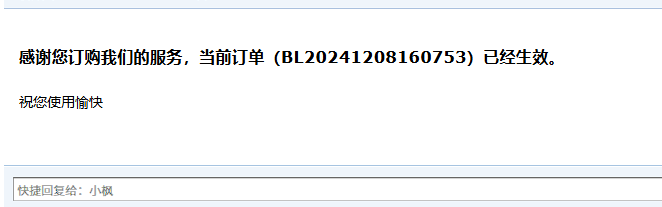

### MidwayJS-Mailer

用于在MidwayJS项目中快捷使用邮件发送功能。

#### 安装使用

```bash
$ npm install nodemailer @types/nodemailer @feng-j/midwayjs-mailer
```
在configuration中引入mailer

```ts
import * as mailer from '@feng-j/midwayjs-mailer';
// ......

@Configuration({
  imports: [
    // ......
    malier,
  ],
  importConfigs: [join(__dirname, './config')],
})
export class MainConfiguration {
  @App('koa')
  app: koa.Application;

  async onReady() {
    this.app.useMiddleware([ReportMiddleware]);
  }
}

```

在配置文件中添加mailer相关的配置, 配置项直接传给nodemailer, 所以配置与nodemailer createTransport参数一致。

```ts
export default {
  // ......
  mailer: {
    host: 'smtp.qq.com',
    secure: true,
    auth: {
        user: 'xxx@xx.com',
        pass: 'xxx'
    }
  },
} as MidwayConfig;

```

然后就可以通过Inject来注入MailerService了

```ts
import { Inject, Controller, Get, Query } from '@midwayjs/core';
import { Context } from '@midwayjs/koa';
import { MailerService } from '@feng-j/midwayjs-mailer';

@Controller('/api')
export class APIController {
  @Inject()
  ctx: Context;

  @Inject()
  mailerService: MailerService;

  @Get('/send')
  async sendEmail() {
    await this.mailerService.send({
      subject: 'custom prefix render',
      to: 'xxxx@qq.com',
      text: 'Hello!',
    })
  }
}

```

更多使用方法可以见[nodemailer 文档](https://www.nodemailer.com/)

#### 模板渲染

除了基本文本内容邮件的发送，还可以在邮件中嵌入HTML内容，通过模板引擎渲染，目前支持`ejs`、`pug`和`nunjucks`模板引擎的渲染。(如果要是用其他的模板引擎，可以将渲染完成的htmlStr手动传入, 后期可以支持自定义渲染）

以ejs模板引擎为例，在配置文件中开启模板渲染的支持

```ts
export default {
  // ......
  mailer: {
    host: 'smtp.qq.com',
    secure: true,
    auth: {
        user: 'xxx@xx.com',
        pass: 'xxx'
    },
    template: 'ejs',
  },
} as MidwayConfig;

```

需要额外安装ejs的依赖库

```bash
$ pnpm i ejs
```
然后准备一个模板文件，例如：

```ejs
<!doctype html>
<html lang="zh">
<head>
  <meta charset="UTF-8">
  <meta name="viewport" content="width=device-width, initial-scale=1">
  <title>Order</title>
</head>
<body>
<h3>
  感谢您订购我们的服务，当前订单（<%= orderId %>）已经生效。
</h3>
祝您使用愉快
</body>
</html>

```

然后在发送邮件的时候传入模板文件路径，以及模板数据，例如：
```ts
import { Inject, Controller, Get, Query } from '@midwayjs/core';
import { Context } from '@midwayjs/koa';
import { MailerService } from '@feng-j/midwayjs-mailer';
import { join } from 'path';

@Controller('/api')
export class APIController {
  @Inject()
  ctx: Context;

  @Inject()
  mailerService: MailerService;

  @Get('/send')
  async sendEmail() {
    await mailerService.send(
      {
        subject: 'templateMail',
        from: '小枫 <youremail@xx.com>',
        to: 'xxxx@qq.com',
      },
      {
        path: join(__dirname, './fixtures/templateMail/src/template/order.ejs'),
        record: { orderId: 'BL20241208160753' },
      }
    );
  }
}

```

发送邮件效果如下：


